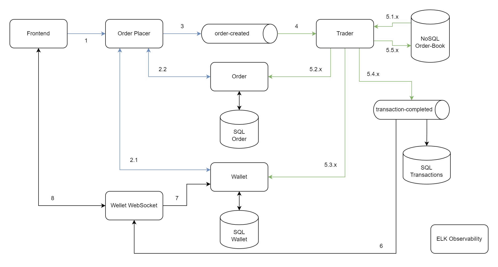

# Meli Order-Book

Em um Order Book ou Livro de ofertas contém as ofertas de compra e venda para um determinado ativo (Vibranium).
Ao realizar uma oferta de venda, a quantidade ofertada é subtraída da carteira e entra em trade com valor requerido pelo vendedor.
Ao realizar uma oferta de compra, o total em dinheiro (tamanho da oferta x preço desejado de compra) é subtraído da carteira e entra em trade.
Quando um ofeta de compra encontra uma ofeta de venda compatível (ou vice-versa), ocorre uma transação e os valores correpondentes são depositados nas carteiras envolvidas:
é adicionado a quantiade de vibranium na carteira do comprador; é adicionado o valor total da transação na carteira do vendedor. Também são salvos os dados com detalhes sobre a transação.

## Rodando a aplicação

**1 - Faça do clone deste repositório**  

``
git clone https://github.com/LuanPSantos/Meli-Order-Book.git
``

**2 - Navegue até o diretório raíz do projeto** 

``
cd Meli-Order-Book/order-book
``

**3 - Rode o seguinte comando:**  

``
docker-compose up -d --build
``

**4 - Importe a seguinte Postman Collection:**  

[Order-Book-Postman-Collection](https://github.com/LuanPSantos/Meli-Order-Book/blob/main/postman/Order%20Book.postman_collection.json)

**5 - Utilize os seguintes Wallet-IDs para realizar as operações**
- walletId: 1  
- walletId: 2  
- walletId: 3  
- walletId: 4  

## Casos de Uso (MVP)

### Get Order Book (Buscar livro de ofertas)
**Input**:  
None  

**Output**:  
Bids e Asks que estão em trade no momento da consulta

---
### Get Wallet By ID (Buscar carteira pelo ID)
**Input**:  
ID da Carteira

**Output**:  
Valores atuais na carteira e valores atuais em trade pertencentes a carteira (quantiade de dinheiro e quantiade de vibranium)

---
### Place a Sell Order (Realizar uma oferta de venda)
**Input**:  
Quantiade à venda, o valor pedido por cada unidade de vibranium e o ID da carteira

**Output**:  
None

---
### Place a Buy Order (Realizar uma oferta de compra)
**Input**:  
Quantiade que se quer comprar, o valor máximo desejada que se pagar por cada unidade de vibranium e o ID da carteira

**Output**:  
None

---
### Get Trade History (Buscar hsitórico de transações)
**Input**:  
número da página e tamanho da página

**Output**:  
Lista com as trasações realizadas

---
### Cancel a Sell Order (Cancelar uma orfeta de venda)
**Input**:  
ID da oferta

**Output**:  
None

---
### Cancel a Buy Order (Cancelar uma orfeta de compra)
**Input**:  
ID da oferta

**Output**:  
None

## Arquitetura (Solução final)

**Order Placer** e **Trader** são microserviços orquestradores. Caso ocorra alguma falha, eles serão responsáveis por realizar os devidos _rollbacks_

### Fluxo feliz
**1** - O Frontend realiza uma request para criar uma nova Orfeta (venda/compra)  

**2.1** - O valor (vibranium/dinheiro) é subtraído da Carteira do usuário  
**2.2** - Uma nova Oferta é criada com o valor subtraído da Carteira  

**3** - A nova Oferta é enviada para uma fila para ser processada

**4** - A nova Oferta é consumida pelo serviço que vai processar a Trade

**5.1.x** - O Livro de Ofertas é carregado por completo e a coleção é trancado (Lock pessimista)  
**5.2.x** - A Oferta fechada é atualizada  
**5.3.x** - O valor da transação é depositado na Carteria  
**5.4.x** - O evento de transação completada com sucesso é emitodo  
**5.5.x** - O Livro de Ofertas é atualizado por completo e a coleção é destrancada  
_**X** é o número de _matches_ que ocorreram entre a nova Oferta e as Ofertas que existiam no Book - uma Transação para cada venda/compra_

**6** - O evento de transação completada com sucesso é consumido por um WebSocket Server   
**7** - Os estado atual da Carteira é carregado  
**8** - E enviado para o Frontend  
